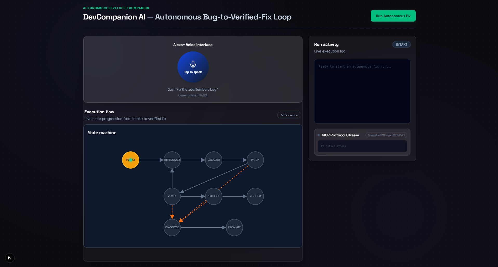
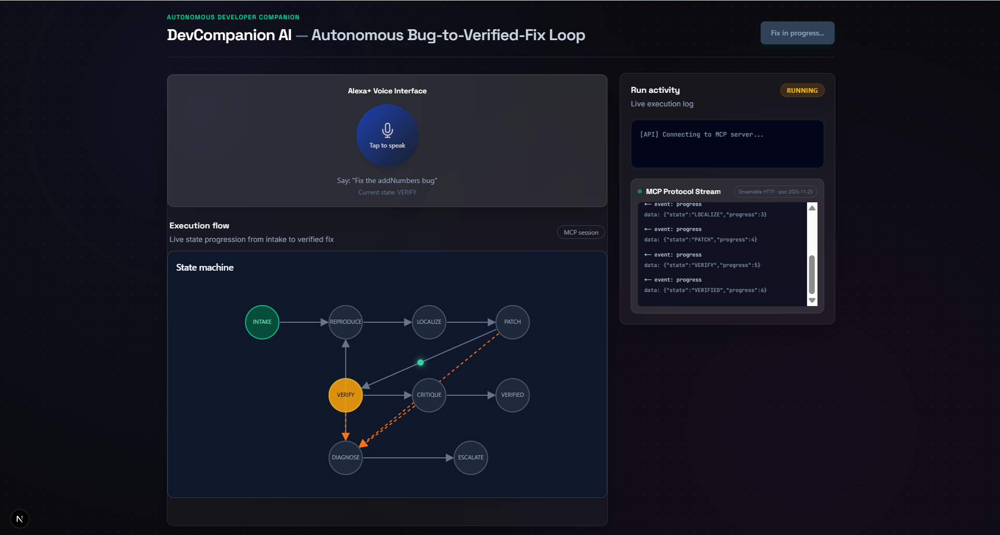
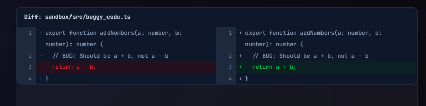
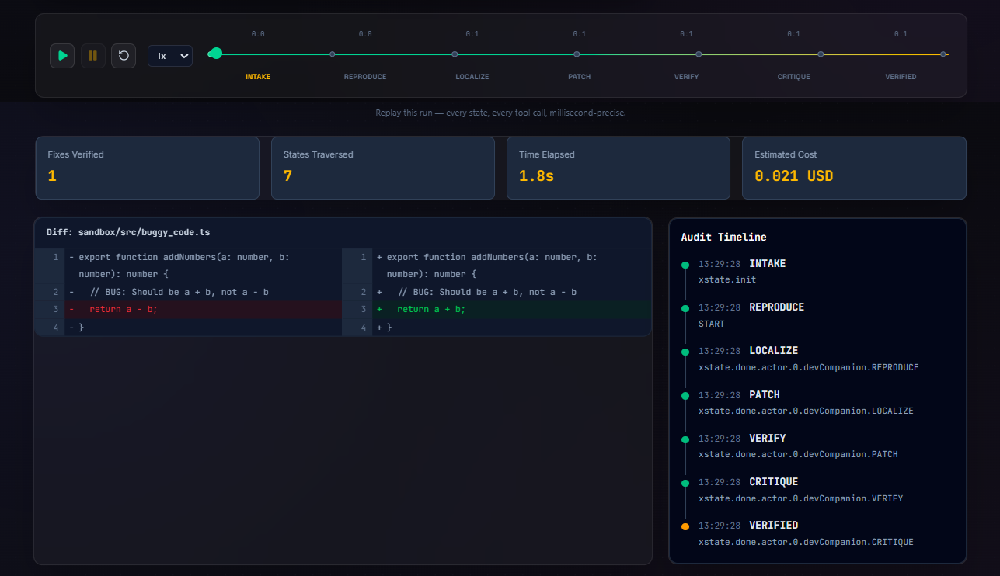
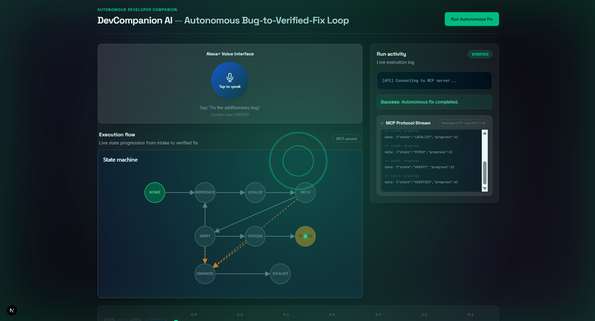

# DevCompanion AI — Autonomous Bug-to-Verified-Fix Loop

[](https://modelcontextprotocol.io/)
[](https://modelcontextprotocol.io/specification/2025-11-25/basic/transports)
[](https://xstate.js.org/)
[](https://www.typescriptlang.org/)

> **Status: 🔒 Feature Frozen — Oct 10, 2026.** All development locked. Focus: demo video and submission.

## Elevator Pitch

DevCompanion AI is a self-hosted [Model Context Protocol (MCP)](https://modelcontextprotocol.io/) server that autonomously detects, fixes, and verifies software bugs. A deterministic nine-state [XState](https://xstate.js.org/) finite state machine (FSM) controls every run, records an audit trail, and makes retry or escalation decisions explicit.

The project was built for the **Amazon Developer Hackathon (Alexa+ Track)**. It is designed to turn a bug report into a reproducible, reviewable, and verified patch while keeping execution under the developer's control.

## Architecture

DevCompanion AI is organized into six cooperating planes:

| Plane | Responsibility |
| --- | --- |
| **Client** | Connects an MCP-compatible host, such as the MCP Inspector, to the server and starts fix runs. |
| **Protocol** | Exposes tools over MCP using Streamable HTTP at `/mcp`. |
| **Agent (FSM)** | Orchestrates the deterministic nine-state bug-to-fix lifecycle with XState, retry limits, and budget guards. |
| **Execution (Sandbox)** | Reads source, searches symbols, runs commands, and applies targeted patches in the target repository or sandbox. |
| **Presentation (UI)** | Streams state and progress updates so a client can show the run as it happens. |
| **Observability (Audit Log)** | Records state entries, triggering events, timestamps, and cost context for each run. |

```text
MCP Client
    │  Streamable HTTP
    ▼
Protocol Plane (/mcp)
    │
    ▼
Agent Plane (XState FSM) ───────► Presentation Plane (progress updates)
    │
    ▼
Execution Plane (sandbox tools) ─► Observability Plane (audit log)
```
## Screenshots

### Live Dashboard — Autonomous Fix in Progress


### State Machine Animating in Real-Time


### Before/After Diff — Real Disk Change


### Time-Travel Scrubber & MCP Protocol Stream


### Success Pulse — Autonomous Fix Verified


---

## The 9-State Machine

Every run starts in `INTAKE`. Successful work moves forward through reproduction, localization, patching, verification, and critique. Recoverable failures enter `DIAGNOSE`; exhausted retries or explicit escalation end in `ESCALATE`.

| State | Entry action | Exit guards and transitions |
| --- | --- | --- |
| `INTAKE` | Creates an audit-log entry for the new session. | `START` → `REPRODUCE`; `ESCALATE` → `ESCALATE`. |
| `REPRODUCE` | Records entry and invokes the reproduction/test actor. | Successful completion → `LOCALIZE`; failure → `DIAGNOSE`. |
| `LOCALIZE` | Records entry and searches the target source for the relevant symbol. | Successful completion → `PATCH`; failure → `DIAGNOSE`. |
| `PATCH` | Records entry and applies the targeted source change. | Successful completion → `VERIFY`; failure → `DIAGNOSE`. |
| `VERIFY` | Records entry and runs verification tests or commands. | Successful completion → `CRITIQUE`; failure → `DIAGNOSE`. |
| `CRITIQUE` | Records entry and invokes adversarial critique. | Approval or successful completion → `VERIFIED`; rejection/failure → `DIAGNOSE`. |
| `VERIFIED` | Records the final successful state in the audit log. | Final state; no further transition. |
| `DIAGNOSE` | Records the failure and prepares the run for recovery. | `START` → `REPRODUCE` when `canRetry` is true; otherwise → `ESCALATE` when `cannotRetry` is true. |
| `ESCALATE` | Records the terminal escalation event. | Final state; requires human intervention or a later run. |

The retry guard requires both `iteration < maxIterations` and `costSpent < maxBudget`. This makes the loop deterministic and prevents an unsuccessful run from retrying indefinitely.

## Setup

```bash
git clone https://github.com/keshavvashishth212121-oss/devcompanion-ai.git
cd devcompanion-ai
npm install
npx tsx src/server.ts
```

In another terminal, launch the MCP Inspector:

```bash
npx @modelcontextprotocol/inspector
```

Connect the inspector or another MCP-compatible client to:

```text
http://localhost:8000/mcp
```

The server uses **Streamable HTTP** for MCP communication.

## Available Tools

| Tool | Purpose |
| --- | --- |
| `start_fix_run` | Initializes a fix session and returns its session ID. |
| `simulate_transition` | Requests a named state transition for transition-flow demonstrations. |
| `read_file` | Reads UTF-8 source content from disk. |
| `search_symbols` | Searches TypeScript files for a symbol and reports matching file paths and line numbers. |
| `run_tests` | Runs a supplied test or verification command in an optional working directory. |
| `apply_patch` | Replaces matching source content with the proposed fix. |
| `run_autonomous_fix` | Runs the complete bug-to-verified-fix loop and streams live state progress. |

## Key Features

- **Deterministic 9-state XState FSM** — The LLM proposes, the state machine disposes.
- **Self-hosted MCP server** — Streamable HTTP transport, spec 2025-11-25.
- **Real disk-level code modification** — Agent reads, patches, verifies files on disk.
- **Event-sourced audit log** — Every transition recorded with millisecond timestamps.
- **Time-Travel Replay Scrubber** — Drag through any past run, second-by-second.
- **Live MCP Protocol Stream** — Watch raw JSON-RPC messages flow in real time.
- **Alexa+ Voice Interface** — Web Speech API for voice commands and narration.
- **Success Pulse Animation** — Cinematic visual confirmation on verified fixes.
- **Cloud deployment** — Vercel (dashboard) + Railway (MCP server) with graceful fallback.

## How It Works

For example, a client can call `run_autonomous_fix` with `sandbox/src/buggy_code.ts` as the target of a bug report. The agent autonomously transitions through seven states:

```text
INTAKE → REPRODUCE → LOCALIZE → PATCH → VERIFY → CRITIQUE → VERIFIED
```

It reproduces the problem, locates the relevant symbol, applies the patch on disk, verifies the result, and runs a critique step before reporting success. If a step fails, the FSM enters `DIAGNOSE` and either retries within its configured limits or transitions to `ESCALATE`.

## Friction Log

See the project's [Friction Log](./FRICTION_LOG.md) for implementation notes, constraints, and lessons learned during development.

## Tech Stack

- **Node.js** — runtime for the self-hosted MCP server
- **TypeScript** — typed implementation language
- **FastMCP** — MCP server and tool registration
- **XState** — deterministic finite state machine orchestration
- **Zod** — runtime validation for tool inputs
- **MCP SDK** — Model Context Protocol interoperability

## Author

Built solo by **Keshav Vashishth** for the **Amazon Developer Hackathon**.